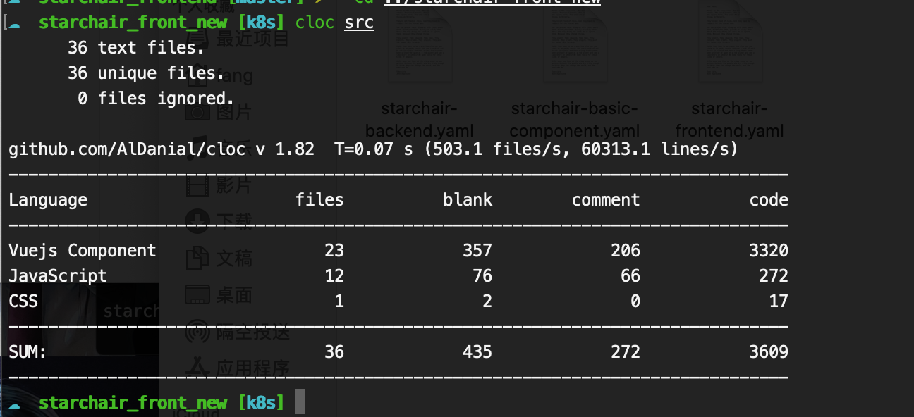

# 基本框架

## 1. 服务端

对于微服务架构，我们可以将服务端分为以下几块内容：

### 1.1 Http-Server

- 语言: Python

- 框架: Flask

  

​		总共拆分了7个服务, 具体参考 [业务拆分思路](breakdown.md)

-----

### 1.2 数据库

每个服务中都带有自己的数据库，在本次项目中，我们统一使用**mongo**作为数据库的服务端。

每个数据库的表都不同，且做了权限保护，**不同服务不能直接访问对方服务的数据库**。

-------

### 1.3 注册中心

使用 **consul** 作为注册中心

在每个server中都单独设置里心跳检测的api用于注册中心的健康检查

同时使用consul提供的api进行服务注册和服务发现

-----

### 1.4 消息队列与异步通信

采用**RabbitMQ-python** 作为消息队列与异步通信的框架，使用websocket提供了消息的通信

------

### 1.5 缓存池

考虑到微服务由多个服务构成，服务存在上下游的依赖关系，因此针对登录/认证这样的服务调用前提依赖，构建了缓存池对用户信息进行存储。

我们使用**Redis**作为用户登录缓存池

-----

## 2. 客户端

我们对前端进行了<mark>全部的重构</mark> 
!!! hint
    我们相信更美观了，也更好用了
* vue2 -> vue3 (使用vue3重构了项目)

* Ant-Design 作为UI

* 使用websocket与消息队列服务进行相连，在前端实现消息的展示

* 更为合理的页面布局和跳转方式

  

==想必看了代码量对比就知道为什么要重构了==

**原项目代码**

**重写后**

