# 操作流程
## 1. 主界面
主界面如下图所示：

在未登陆的情况下点击"GET STARTED"会提示"please login first"，点击右上角的"Sign In/Sign UP"进行登录或注册。

下图为登录界面：

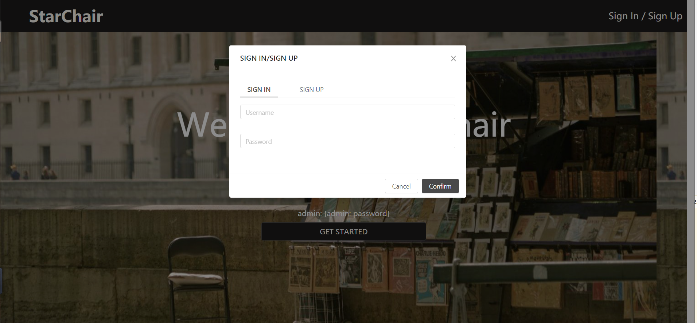

而下图为注册界面：

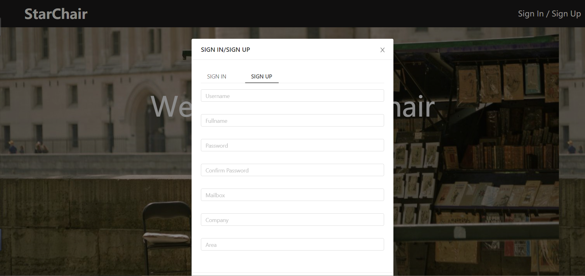

注册界面如果输入不规范会提示：

注册成功后进行登录，登录成功后的界面如下图所示：

点击"GET STARTED"或右上角的"Conference"即可进入会议界面。

## 2. 会议界面
会议界面如下图所示：

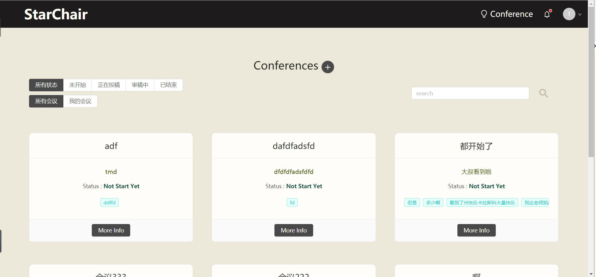

### 2.1. 已有会议

左上可以根据会议状态对会议进行筛选，也可以筛选出只和自己有关的会议。

右上可以根据名字搜索会议。

点击"More Info"可以查看详细信息：

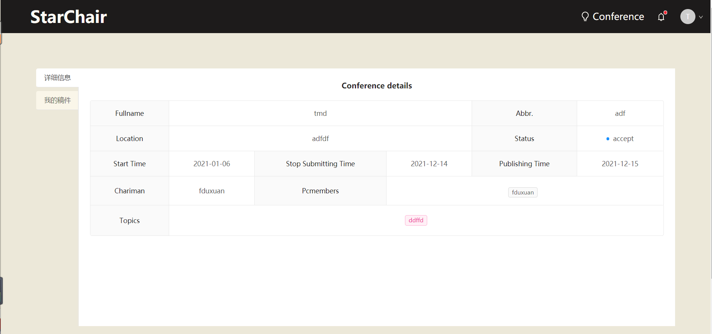

对于正在投稿状态的会议，点击“我的稿件”开启投稿界面

点击上方+号，填写信息并上传稿件：

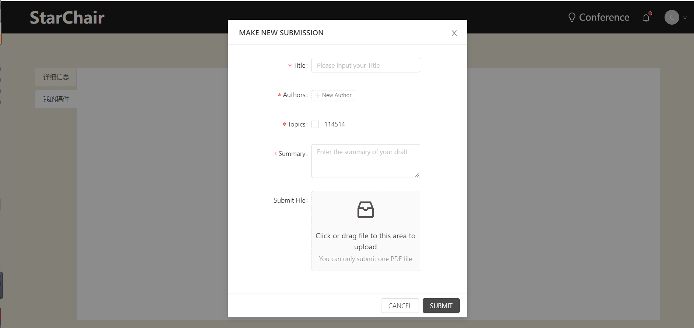

### 2.2. 新建会议
在会议界面，点击上方+号创建会议：

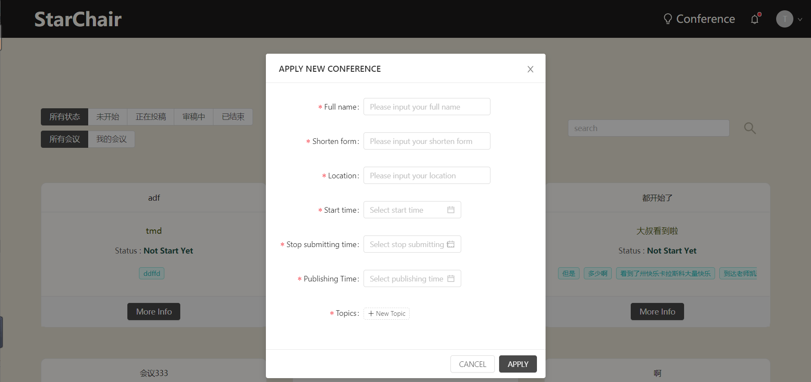

填写所需信息后，会议将提交给管理员进行审核。

## 3. 管理员页面
在管理员页面，可以看到申请的会议信息：

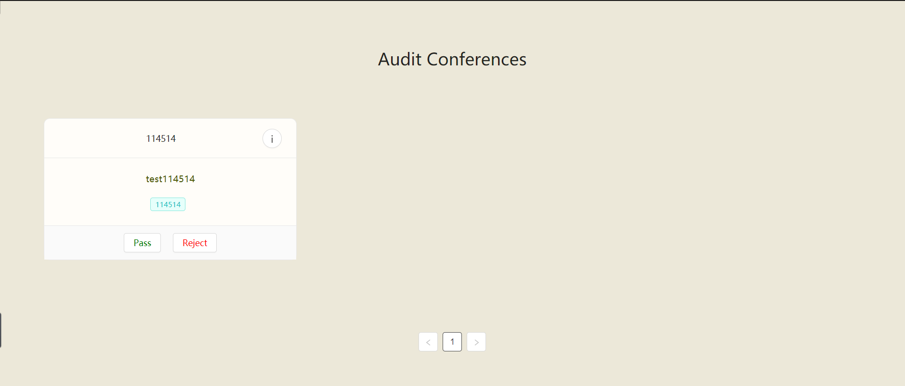

点击每个会议右上的按钮可以查看详细信息，点击下方按钮选择通过或拒绝。

## 4. 审稿

对于自己的会议，会议的详细信息与其他的不同：

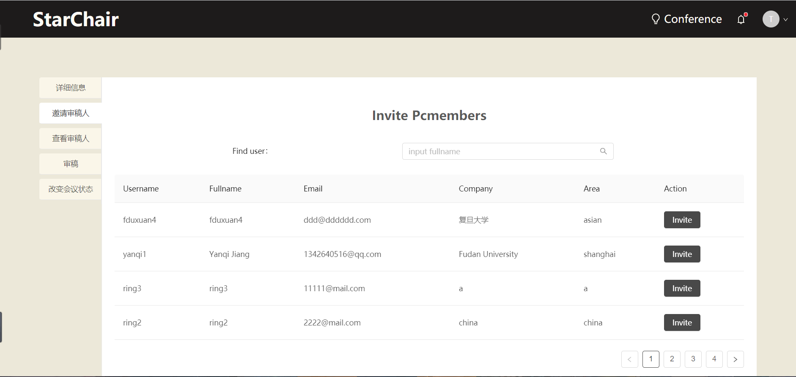

在邀请审稿人界面，可以查询并邀请成员来审稿。

在改变会议状态界面，可以让会议进入下一步：

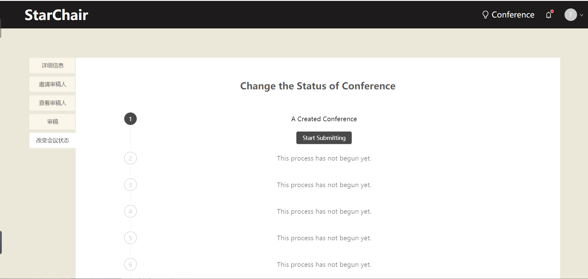

点击start submiting开启投稿。此时审稿人必须至少有三个。

接下来，点击Close Submission & Start Reviewing按钮关闭投稿渠道并开启审稿：

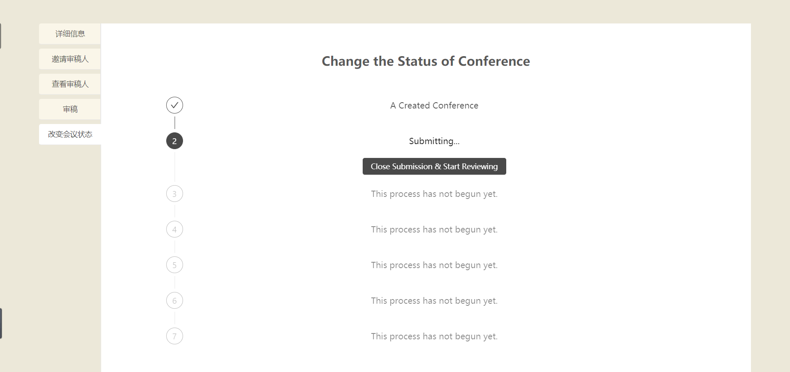

此后，在审稿界面开始审稿：

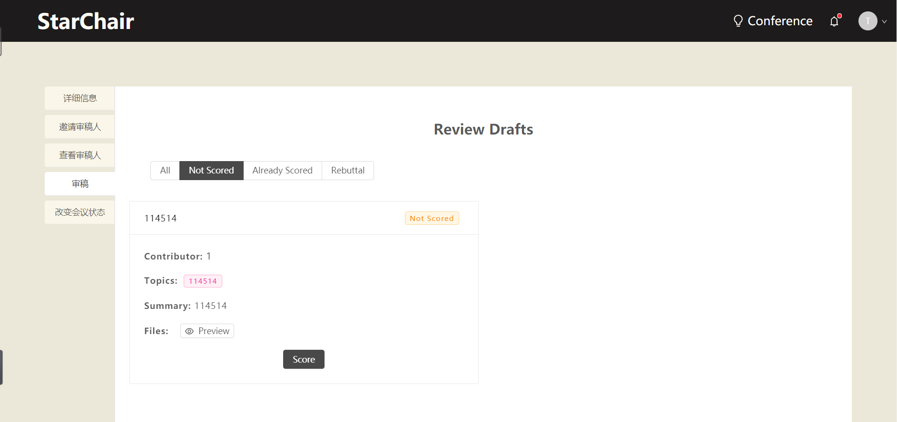

点击preview查看稿件：

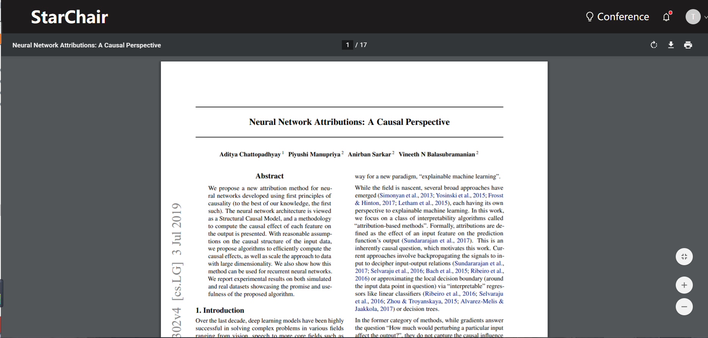

点击score进行评价：

打分完毕后，在改变会议状态界面点击Start First Discussion开始讨论：

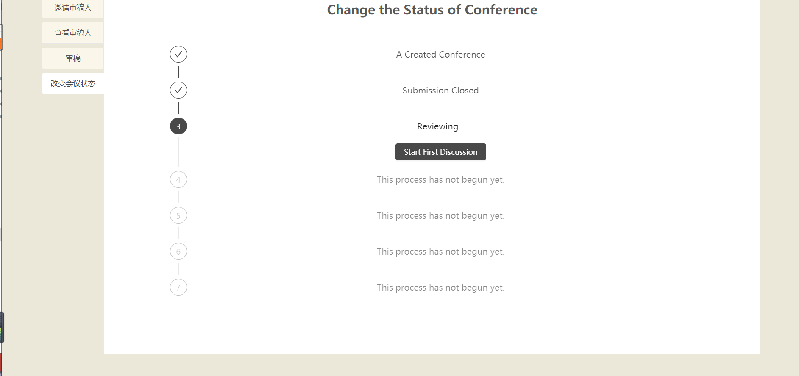

此时在审稿界面出现Discussion按钮，点击进入讨论，可以发表评论或者回复其他人的评论：

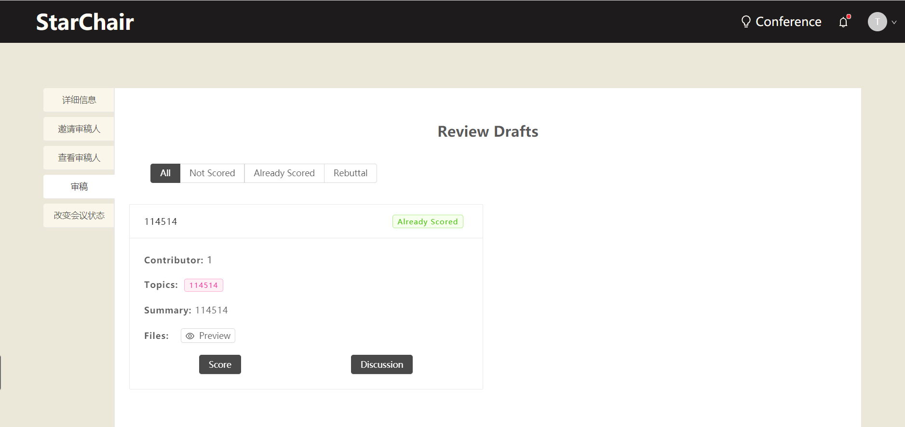

在改变会议状态界面点击按钮，发表初审结果：

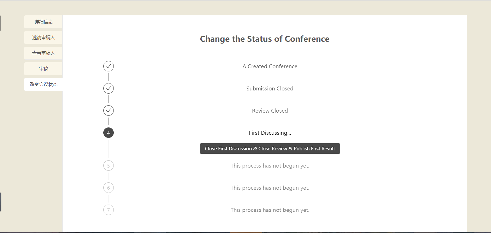

此时提交论文的成员可以在“我的稿件”页面点击View Score查看结果，或者点击Rebuttal发表反驳：

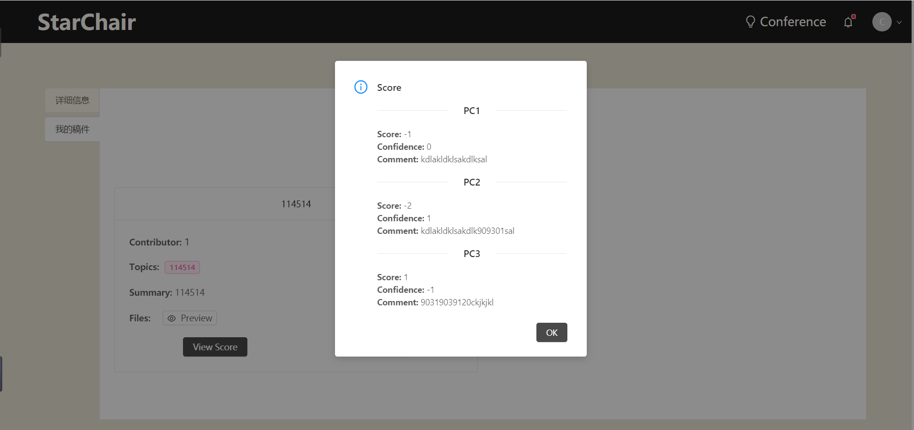

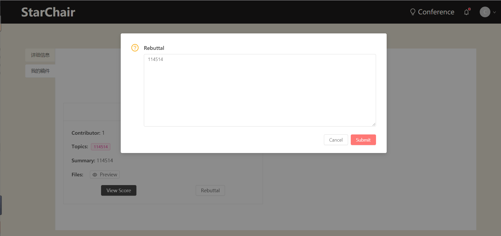

随后pc在改变会议状态界面点击按钮，进行终审并回应反驳，此时可以重新打分并评论：

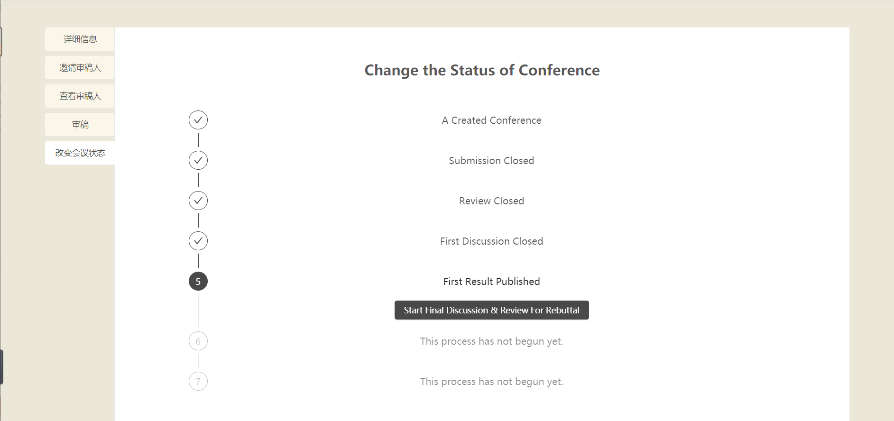

之后点击按钮，发表终审结果：

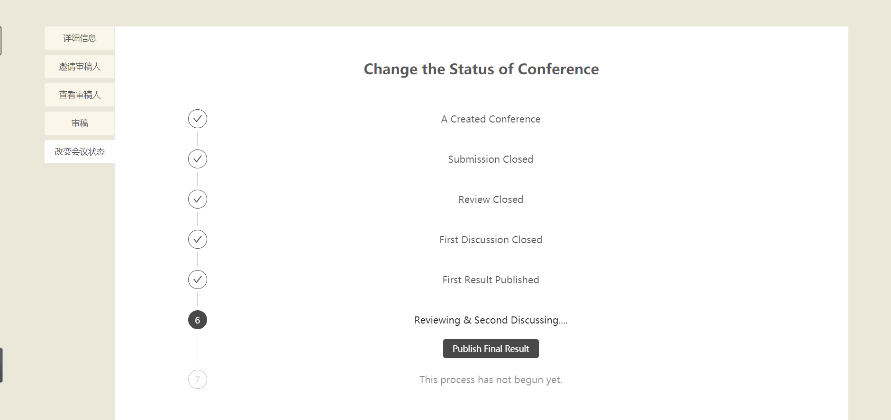

## 5. 邮箱页面
点击上方信息栏的铃铛按钮，可以进入邮箱页面。页面分为3部分：

系统通知：包含新会议的申请或拒绝结果，邀请结果，提交稿件情况等等。可以点击按钮标注为read或unread。

收到邀请：收到的会议审稿邀请。可以点击按钮选择同意或拒绝。

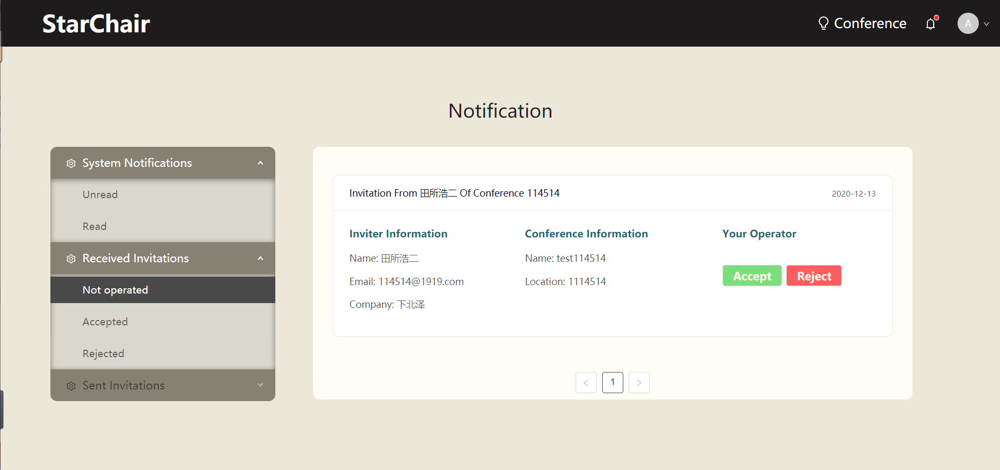

发送邀请：发送的会议审稿邀请。可以查看对方是否同意邀请。

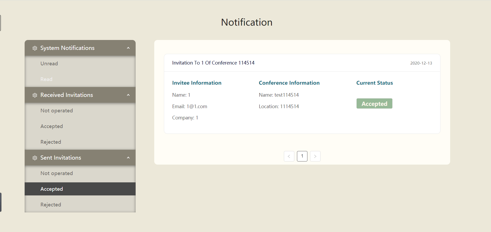
